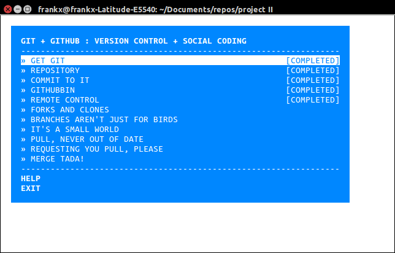

#Get Git-It!

 [NodeSchool](http://nodeschool.io/) provides fantastic open source lesson modules for web technologies. One of these modules is **Git-it**,  a module to learn Git and GitHub basics.
 **NPM** (which is included when you download Node.js) delivers Node.js modules (that's what Git-it is) to your computer from the command line:

``
$ npm install -g git-it
``

That's it! You should be able to run Git-it by entering the following in the terminal window.

``$ git-it``

You should see now see something like this:

Select a menu item and follow the instructions...