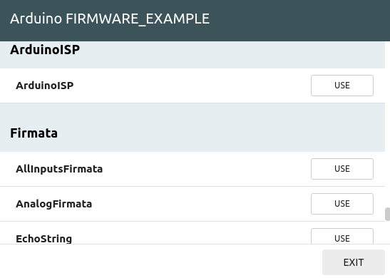
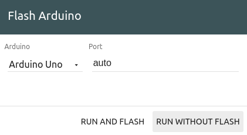

## Introduction
#### source:  http://ocw.cs.pub.ro/courses/iot/labs/08

As previously stated, the classical Arduino board is basically a micro-controller, which is capable of running one piece of software at once and that has little processing power and no network connectivity. So you will use the board to gather data from the environment and then pass it on to the Raspberry Pi.

The Raspberry Pi is a computer that is capable of processing data and communicating with other smart devices. For instance, you could visualise the temperature on your smart phone.

###  Connecting the Pi and Arduino

The two boards need to be connected in order to send data between them. You can connect them via the USB cable and a serial connection will be established between the two. Once this is done, they can exchange data and the Arduino board can be controlled via the Raspberry Pi. This is done by the **firmata** protocol. The protocol allows the Raspberry Pi to send the Arduino messages in which it requests for a certain action or information and the Arduino will respond accordingly.

In order to implement the protocol, you need to flash the Arduino with the **StandardFirmata** firmware.

In the Wyliodrin STUDIO interface you have two tabs referring to **Raspberry Pi** and **Arduino**. Select the **Arduino** tab and there is where you can write code which will be run on the Arduino. In this case, you will import an existing project.

Hit the **Show examples** button and select **Arduino**. Then **use** the **Firmata/StandardFirmata** example. Now that you have the software to run on the Arduino, once you hit the **run** button, you will be asked the type of the Arduino board and if you want to flash it or not. Select the board you are using and **RUN AND FLASH**. The **StandardFirmata** firmware will be deployed on the Arduino.

Any micro-controller, including the Arduino, once flashed, runs the same firmware until another one is uploaded on the board. Thus, you don't have to flash the board each time you run a new Raspberry Pi application. If you are confident that the Arduino is running **StandardFirmata**, you can skip this step.

