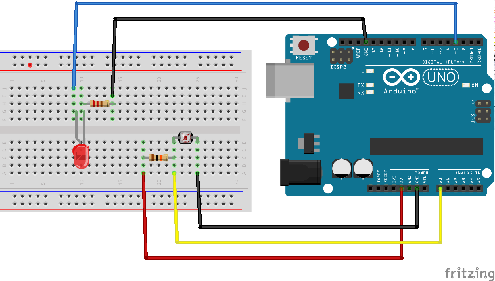

#Build Circuit

In this application, you will build a system to monitor the light level and if there is the case, you will turn on the street lights brighter or dimmer, depending on the amount of light.

## What you need

*   
One Raspberry Pi connect to \Wyliodrin;

*   
One Arduino connected to the Raspberry Pi;

*   
One photocell;

*   
One LED;

*   
One 220 Ω resistor

*   
One 10 kΩ resistor

*   
Jumper wires.

## Physical Setup

The photocell works just like resistor with a variable resistance. Depending on the amount of light it receives, its resistance gets higher or lower. As a result, you can connect it in a voltage divider, as well.

The sensor is connected to the 5V via the 10 K Ohms resistor and to the GND pin on the other side. In order to read the sensor's value, the yellow jumper wire is connected to the A0 pin of the board. The A0-A5 pins can be used for reading digital values, in this case values ranging from 0 to 1024\.

For the photocell, the resistance decreases proportionally with the amount of light, so for this schematics, the brighter the environment, the higher is the read value.

In addition, the photocell has a resistance varying from hundred of ohms to mega ohms and in order for the voltage divider to work, you should use the sensor as a pull-down resistor, while the actual resistor needs to have a resistance comparable with the sensor's, otherwise its effect is not visible. This is why you need a 10 k Ohms resistor.

The other part of the setup, the LED is connected similar to the previous schematics except that you can notice that its behaviour is controller by pin 3\. That pin has a tilde next to it. That means that it is a PWM pin so you can control if the LED should light up brighter or dimmer. You can write values ranging from 0 to 255 on these pins, 0 being the equivalent of digital 0 and 255 the equivalent of digital 1.
