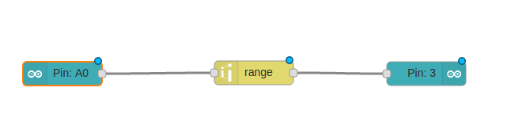
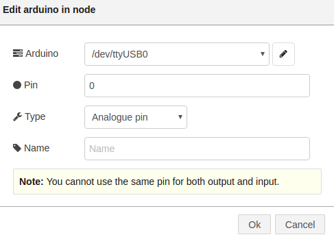
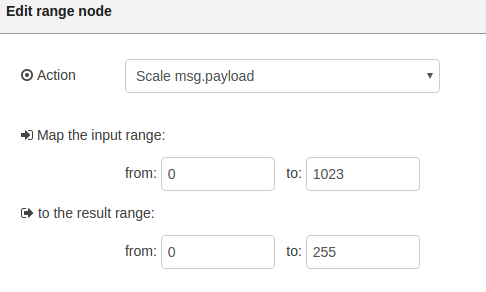
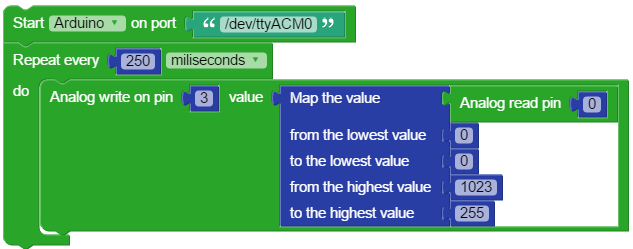

## The Code

First of all, you need to use an **Arduino in** node in order to read the values from the sensor. This node gets triggered each time the value on the pin it reads from changes. To actually configure the node's behavior you need to set its properties.

The first property allows you to set the Raspberry Pi connection to the Arduino board so the Raspberry Pi knows the port through which it should send the messages. Usually, the port is **/dev/ttyACM0**. However, in order to make sure, go to the **Shell** tab and type **dmesg**. There you should see messages stating that an FTDI cable has been connected to the board and the port it is connected to. Concatenate that value to **/dev/** and place the value as the first property of the node.

Further on, you need to specify which pin you want to read from. In this case, the pin is 0 and is an analog pin. Afterwards, you will use a **range** node in order to map the read values to values that should light up the LED. For this, you need to adapt the system to your environment. Depending on the regular amount of light, usually you will read a value of around 400\. So in this case, the range scales values going from 400 to 1024 to 0 to 255\. However, if the regular value is different, you will need to scale a different range.

  

The last node to use is **Arduino out**. This node acts just like the **digital write** node used in the previous chapters. However, you still need to select the port for the Arduino board and you can choose from analog or digital write. As you want to make the LED light up brighter or dimmer, you will set the type to **analog** and the **pin** property has to be 3\.

If you use more than one Arduino node in the application, add a new Raspberry Pi board only for one node. For the rest of the nodes, choose the previously added board from the drop-down.

Now you can run the application and watch how the LED gets brighter as you cover up the sensor.

## Exercises

1.  Display the values coming from the light sensor in the dashboard using the **gauge** graph.

2. Write the program using the Visual programming language. Create a new Visual Programming project called "Street Lights Visual" and use the following code:

2.  Connect all the sensors in the kit to the Arduino and display the values you read in the dashboard. **Note:** Do not connect the Hall sensor, which works in a different way.

3.  Search the temperature sensor's datasheet online (TMP36) and transform the read values to celsius degrees.

