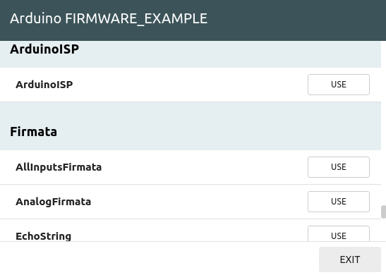
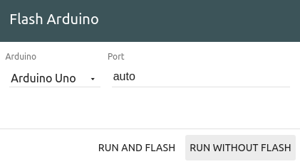
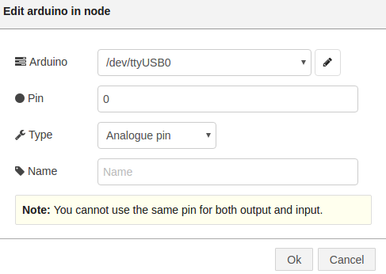
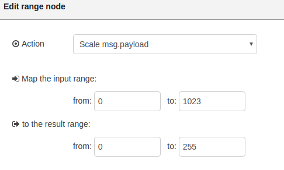

# Wyliodrin: Sensors and Dashboard

## Street Lightning
#### source:  http://ocw.cs.pub.ro/courses/iot/labs/08

### Introduction

As previously stated, the classical Arduino board is basically a micro-controller, which is capable of running one piece of software at once and that has little processing power and no network connectivity. So you will use the board to gather data from the environment and then pass it on to the Raspberry Pi.

The Raspberry Pi is a computer that is capable of processing data and communicating with other smart devices. For instance, you could visualise the temperature on your smart phone.

###  Connecting the Pi and Arduino

The two boards need to be connected in order to send data between them. You can connect them via the USB cable and a serial connection will be established between the two. Once this is done, they can exchange data and the Arduino board can be controlled via the Raspberry Pi. This is done by the **firmata** protocol. The protocol allows the Raspberry Pi to send the Arduino messages in which it requests for a certain action or information and the Arduino will respond accordingly.

In order to implement the protocol, you need to flash the Arduino with the **StandardFirmata** firmware.

In the Wyliodrin STUDIO interface you have two tabs referring to **Raspberry Pi** and **Arduino**. Select the **Arduino** tab and there is where you can write code which will be run on the Arduino. In this case, you will import an existing project.

Hit the **Show examples** button and select **Arduino**. Then **use** the **Firmata/StandardFirmata** example. Now that you have the software to run on the Arduino, once you hit the **run** button, you will be asked the type of the Arduino board and if you want to flash it or not. Select the board you are using and **RUN AND FLASH**. The **StandardFirmata** firmware will be deployed on the Arduino.

Any micro-controller, including the Arduino, once flashed, runs the same firmware until another one is uploaded on the board. Thus, you don't have to flash the board each time you run a new Raspberry Pi application. If you are confident that the Arduino is running **StandardFirmata**, you can skip this step.

##Build Circuit

In this application, you will build a system to monitor the light level and if there is the case, you will turn on the street lights brighter or dimmer, depending on the amount of light.

### What you need

*   
One Raspberry Pi connect to \Wyliodrin;

*   
One Arduino connected to the Raspberry Pi;

*   
One photocell;

*   
One LED;

*   
One 220 <nobr aria-hidden="true">Ω</nobr><math xmlns="http://www.w3.org/1998/Math/MathML"><mi mathvariant="normal">Ω</mi></math><mi mathvariant="normal">&amp;#x03A9;</mi></math>'> resistor;

*   
One 10 k<nobr aria-hidden="true">Ω</nobr><math xmlns="http://www.w3.org/1998/Math/MathML"><mi mathvariant="normal">Ω</mi></math><mi mathvariant="normal">&amp;#x03A9;</mi></math>'> resistor;

*   
Jumper wires.

### The Setup

The photocell works just like resistor with a variable resistance. Depending on the amount of light it receives, its resistance gets higher or lower. As a result, you can connect it in a voltage divider, as well.

The sensor is connected to the 5V via the 10 K Ohms resistor and to the GND pin on the other side. In order to read the sensor's value, the yellow jumper wire is connected to the A0 pin of the board. The A0-A5 pins can be used for reading digital values, in this case values ranging from 0 to 1024\.

For the photocell, the resistance decreases proportionally with the amount of light, so for this schematics, the brighter the environment, the higher is the read value.

In addition, the photocell has a resistance varying from hundred of ohms to mega ohms and in order for the voltage divider to work, you should use the sensor as a pull-down resistor, while the actual resistor needs to have a resistance comparable with the sensor's, otherwise its effect is not visible. This is why you need a 10 k Ohms resistor.

The other part of the setup, the LED is connected similar to the previous schematics except that you can notice that its behaviour is controller by pin 3\. That pin has a tilde next to it. That means that it is a PWM pin so you can control if the LED should light up brighter or dimmer. You can write values ranging from 0 to 255 on these pins, 0 being the equivalent of digital 0 and 255 the equivalent of digital 1\.

## The Code

First of all, you need to use an **Arduino in** node in order to read the values from the sensor. This node gets triggered each time the value on the pin it reads from changes. To actually configure the node's behavior you need to set its properties.

The first property allows you to set the Raspberry Pi connection to the Arduino board so the Raspberry Pi knows the port through which it should send the messages. Usually, the port is **/dev/ttyACM0**. However, in order to make sure, go to the **Shell** tab and type **dmesg**. There you should see messages stating that an FTDI cable has been connected to the board and the port it is connected to. Concatenate that value to **/dev/** and place the value as the first property of the node.

Further on, you need to specify which pin you want to read from. In this case, the pin is 0 and is an analog pin. Afterwards, you will use a **range** node in order to map the read values to values that should light up the LED. For this, you need to adapt the system to your environment. Depending on the regular amount of light, usually you will read a value of around 400\. So in this case, the range scales values going from 400 to 1024 to 0 to 255\. However, if the regular value is different, you will need to scale a different range.

  

The last node to use is **Arduino out**. This node acts just like the **digital write** node used in the previous chapters. However, you still need to select the port for the Arduino board and you can choose from analog or digital write. As you want to make the LED light up brighter or dimmer, you will set the type to **analog** and the **pin** property has to be 3\.

If you use more than one Arduino node in the application, add a new Raspberry Pi board only for one node. For the rest of the nodes, choose the previously added board from the drop-down.

Now you can run the application and watch how the LED gets brighter as you cover up the sensor.

## Exercises

1.  Display the values coming from the light sensor in the dashboard using the **gauge** graph.

2. Write the program using the Visual programming language. Create a new Visual Programming project called "Street Lights Visual" and use the following code:

2.  Connect all the sensors in the kit to the Arduino and display the values you read in the dashboard. **Note:** Do not connect the Hall sensor, which works in a different way.

3.  Search the temperature sensor's datasheet online (TMP36) and transform the read values to celsius degrees.

