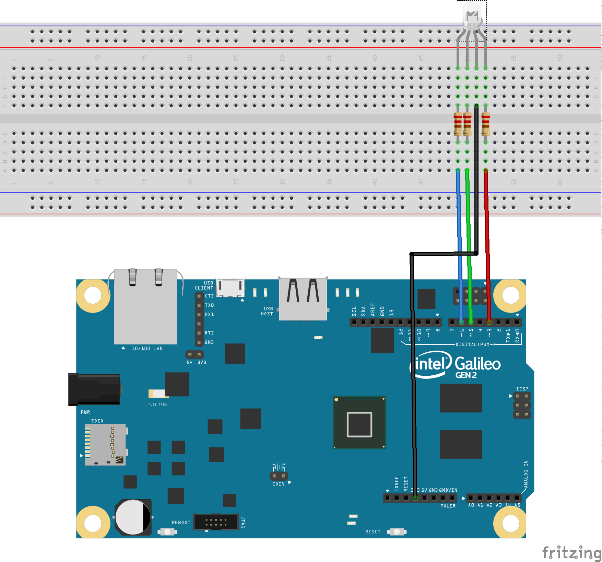
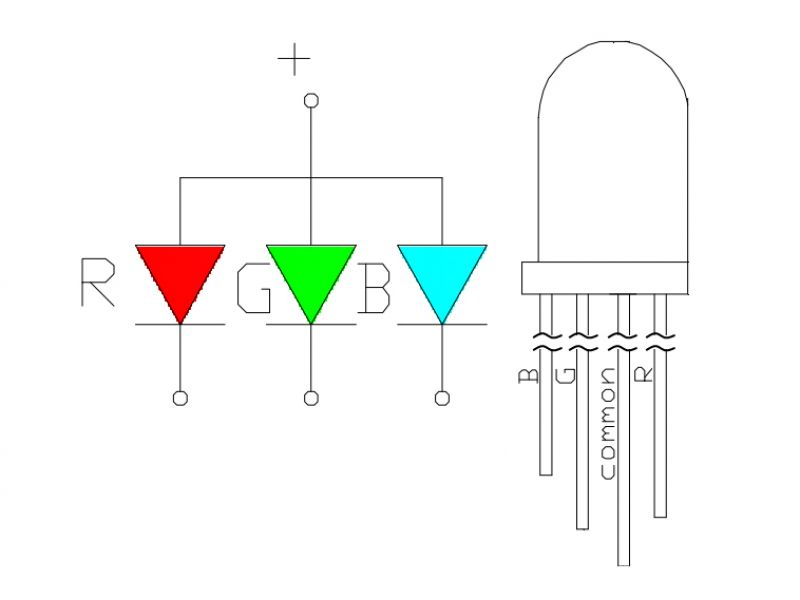
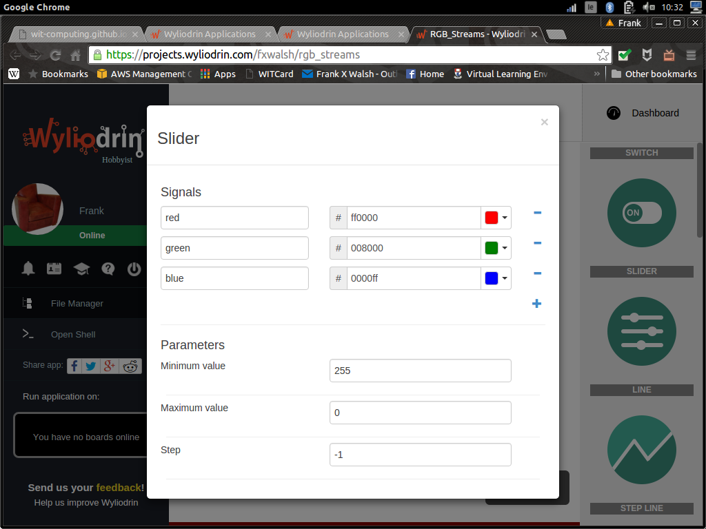

## Equipment
* Intel Galileo Gen 2 connected to Wyliodrin
* An RGB led (from the Arduino workshop)
* Ethernet cable
* Laptop

## Goal
- Light up an RGB LED in different colors. 
- Control the intensity and colour using Pulse Width Modulation (PWM).

## The Circuit
Connect the RGB LED to the Galileo as shown in the following diagram:

The RGB LED combines of  three LEDs: a red one, a green one and a blue one. Each of these LEDs is controlled by a PWM pin (indicated by a "~" on the board), so that it's brightness cna be controlled. As these are promary colours, by controling the "brightness" of each LED, the overall colour can be set.

## Make it Work (Sketch)
The following sketch will cycle through Red, Green, and Blue:

~~~
#include <Arduino.h>
int redPin = 3;
int greenPin = 5;
int bluePin = 6;

void setColor(int red, int green, int blue)
{
  analogWrite(redPin,255-red);
  analogWrite(greenPin,255-green);
  analogWrite(bluePin, 255-blue);  
}
 
void setup()
{
  pinMode(redPin, OUTPUT);
  pinMode(greenPin, OUTPUT);
  pinMode(bluePin, OUTPUT);  
}
 
void loop()
{
  setColor(255, 0, 0);  // red
  delay(1000);
  setColor(0, 255, 0);  // green
  delay(1000);
  setColor(0, 0, 255);  // blue
  delay(1000);
  setColor(255, 255, 0);  // yellow
  delay(1000);  
  setColor(80, 0, 80);  // purple
  delay(1000);
  setColor(0, 255, 255);  // aqua
  delay(1000);
}
~~~

Push the code to your device. CHALLENGE: Change the code to include your own colours.

###Make it Work (Streams)
In this section we'll use a programming approach callled *streams* to control the RGB LED.  Wyliodrin provides the ability to write Streams programs. 

- Create a new app in Wyliodrin called *RGB Streams*

- Create the following streams program by selecting and configuring the correct nodes:

- Now create a *Dashboard* to supply the signals (i.e. red, green blue)  for the program.

- If all is well, you should now be able to delpoy the application to the Galileo and control it using the dashboard.

###Further Challenges:
- Make a Streams application and use it to create a project that will light up a LED for 3 seconds at one press of a button.
- Do the same, using a switch from the dashboard instead of the button.
- Connect a button that you will have to press in order to turn on an LED and press again to turn the LED off.
- The same, only that if you have pressed the button once, for the next two seconds, pressing again the button will have no effect. In a nutshell, once you press the button, it will become inactive for the next two seconds.
- The same, but using the switch from the dashboard instead of the button.

###References
[Programming with Streams lab, IoT Summer School 2015, Innovations lab](http://ocw.cs.pub.ro/courses/iot/labs/04) 
[Adafruit Arduino Lessons](https://learn.adafruit.com/adafruit-arduino-lesson-3-rgb-leds/arduino-sketch)  

